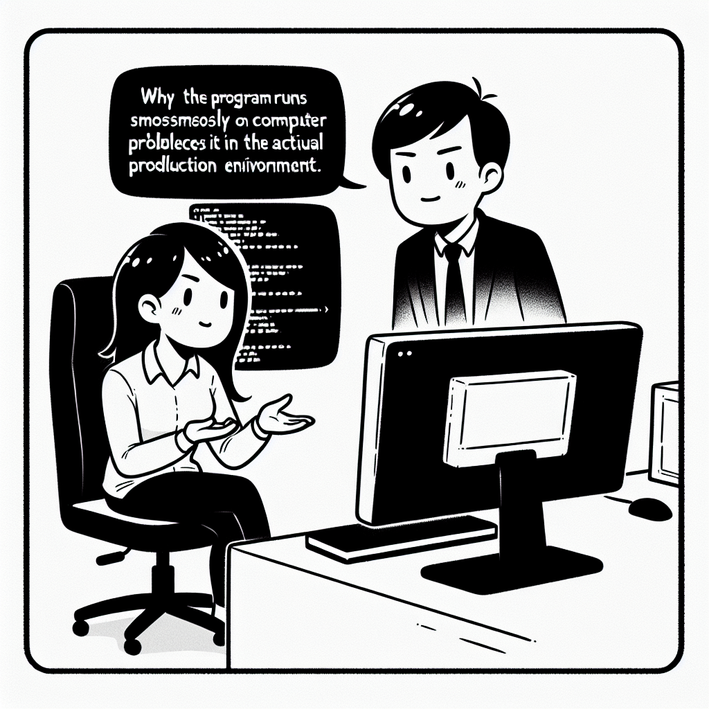

### Daily Comic Strip

### Student Audit

*Last Audit Update: 2026-02-20 07:42:17 (Taipei Time)*

| Student | Summary |
| :--- | :--- |
| **Yu-1227** | [Summary: The student has shared progress visuals related to Spin Torque Device work, seemingly making strides in device development or testing, however, alignment with the plan cannot be confirmed with provided logs.](https://github.com/MYlabTaiwan/Meeting/issues/15) |

### Meeting
Administration of the group meeting
| Tuesday(Fabrication)     |     | Wednesday (Properties)     |     | Thursday  (Materials)  |      |
|----------|--------|--------------------|--------|----------------------|--------|
| 09:00–09:10           | Guan-Ting | 09:00–09:10           |Thomas  | 09:00–09:10         | Karthika, Chun-Yang, Yi-Chin |
| 09:10–09:20           | Rui-Hong  | 09:10–09:20           | Benjamin | 09:10–09:20         |        |
| 09:20–09:30           | Peter    | 09:20–09:30           | Su Kuang-Yu | 09:20–09:30         |        |
| 09:30–09:40           | Ting-Chun | 09:30–09:40           | Shiphrah  | 09:30–09:40         | Vincent |
| 09:40–09:50           | En-Chi       | 09:40–09:50           | Patrick | 09:40–09:50        | Ted    |
| 09:50–10:00           | Ying-Chih       | 09:50–10:00           |  Suraj       | 09:50–10:00         |  Chen Guang-Yu      |
| 10:00–10:10           |  | 10:00–10:10           |  Yu-Hui     |    10:00 -10:10      | Hui-Ting|
|                       |        | 10:10–10:20           |  |                      |        |