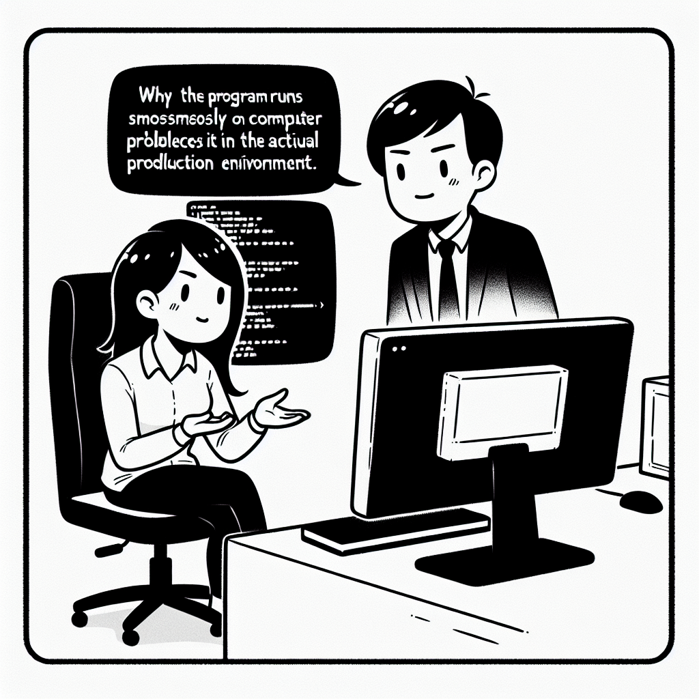

### Daily Comic Strip

### Student Audit

*Last Audit Update: 2026-03-04 07:40:18 (Taipei Time)*

| Student | Summary |
| :--- | :--- |
| **hank910114** | [Summary] Conducted test of 1st electrode fabrication with specific material layers, observed fine results, and planned growth of 2nd electrodes with larger overlap. |
| **poman920819** | [Summary] Successfully measured the Raman spectrum of Graphene/MoS₂ using both a 785 nm laser and an older Raman system, despite a full day of classes. |
| **PatrickSharks** | Gave up on troubleshooting inaccurate Raman measurements for filament samples. |
| **r13222062-hub** | [Summary: Attempted dry transfer print, but observed challenges with sample wetness affecting Raman mapping and AFM, MoS2 melting under laser irradiation, and the need for a method to wash the sample without damaging it or disrupting MoS2 distribution.] |
| **r13222052-boop** | [Summary] Completed work on growing another batch of W5N6 and conducted paper reading to improve the story, aligning with today's goals. |
| **Xylon-code** | [Summary] Experimental conditions, including electrode placement and plasma treatment, significantly influence graphene deposition patterns, confirming the importance of precise process parameters. |
| **Yu-1227** | [Summary] Evaluated the magnetic moment with SQUID data but will double-check due to potential errors, identified the lack of a lock-in amplifier and proposed solutions, and attempted to create a Hall bar structure on graphene but faced issues with lithography. |
| **harold0104** | Conducted the silicon deposit experiment with applied voltage despite IV measurement issues, planning to measure Raman tomorrow. |

### Meeting
We will have online meetings under [https://meet.google.com/mcv-eqeu-dob](https://meet.google.com/mcv-eqeu-dob)
Please log in on time!

| Monday |  | Tuesday (Fabrication) |  | Wednesday (Properties) |  | Thursday |  | Friday (Materials) |  |
|---|---|---|---|---|---|---|---|---|---|
|  |  | 09:00–09:10 | Guan-Ting | 09:00–09:10 | Thomas |09:30–11:00   |**Group meeting (R716)**  | 09:00–09:10 | Karthika, Chun-Yang, Yi-Chin |
|  |  | 09:10–09:20 | Rui-Hong | 09:10–09:20 | Benjamin |  |  | 09:10–09:20 |  |
|  |  | 09:20–09:30 | Peter | 09:20–09:30 | Su Kuang-Yu |  |  | 09:20–09:30 |  |
|  |  | 09:30–09:40 | Ting-Chun | 09:30–09:40 |  |  |  | 09:30–09:40 |  |
|  |  | 09:40–09:50 | En-Chi | 09:40–09:50 | Patrick |  |  | 09:40–09:50 | Ted |
|  |  | 09:50–10:00 |  | 09:50–10:00 | Suraj |  |  | 09:50–10:00 | Chen Guang-Yu |
|  |  | 10:00–10:10 | Yu-Hui | 10:00–10:10 | Ying-Chih |  |  | 10:00 -10:10 | Hui-Ting |
|  |  |  |  | 10:10–10:20 |  |  |  |  |  |
